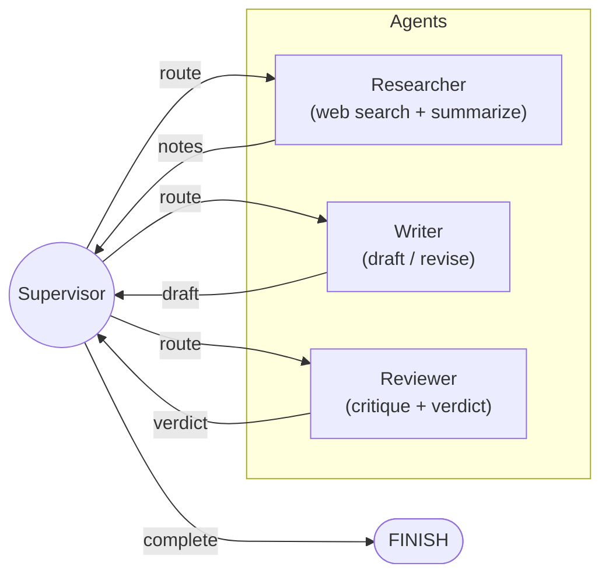

# Multi-Agent Research Assistant

<p align="center">
  <strong>LangGraph-based multi-agent research system with supervisor routing, web research, writing, review, iterative refinement, and human-in-the-loop support.</strong>
</p>

<p align="center">
  <a href="#"></a>
  <a href="#"></a>
  <a href="#"></a>
  <a href="#"></a>
  <a href="#"></a>
  <a href="#"></a>
  <a href="#"></a>
</p>

<p align="center">
  <a href="https://github.com/Talha-Techie">GitHub Profile</a> ·
  <a href="#quick-start">Quick Start</a> ·
  <a href="#architecture">Architecture</a> ·
  <a href="#security">Security</a>
</p>

---

## Overview

**Multi-Agent Research Assistant** coordinates specialized AI agents for research, writing, and editorial review using LangGraph. A supervisor inspects shared state and routes work to the researcher, writer, or reviewer until the task reaches an accepted result.

The project demonstrates supervisor routing, conditional graph edges, external tool use, multi-provider LLM configuration, human-in-the-loop interruption, and an iterative writer/reviewer refinement loop.

### Business / Engineering Value

- Supervisor-driven dynamic routing instead of a fixed pipeline.
- Researcher agent with Tavily web search and summarization tools.
- Writer agent for structured report generation and revision.
- Reviewer agent with ACCEPT/REVISE evaluation.
- Up to three revision cycles.
- OpenAI and Anthropic provider switching via environment configuration.
- LangGraph human-in-the-loop support using `interrupt_before`.

## Technology Stack

| Layer | Technology |
|---|---|
| Orchestration | LangGraph |
| LLMs | OpenAI / Anthropic |
| Web search | Tavily |
| Configuration | python-dotenv + Pydantic |
| Build | Hatch |
| Package manager | uv |
| Deployment | Docker |

---

## Architecture



### Agent Roles

| Agent | Role | Tools |
|---|---|---|
| **Supervisor** | Inspects shared state and routes work to the appropriate specialist agent. Decides when the task is complete. | None (LLM-based routing) |
| **Researcher** | Gathers information from the web relevant to the user's query and distils it into structured notes. | `web_search` (Tavily), `summarize` |
| **Writer** | Transforms research notes into a polished, well-structured report. Incorporates reviewer feedback on revisions. | LLM generation |
| **Reviewer** | Critiques the draft for accuracy, clarity, and completeness. Issues an **ACCEPT** or **REVISE** verdict. | LLM evaluation |

### Key Patterns

- **Supervisor routing** -- a central coordinator node uses conditional edges to dispatch work, avoiding brittle hard-coded pipelines.
- **Human-in-the-loop** -- the graph can be paused before the reviewer node using LangGraph's `interrupt_before` mechanism, allowing a human to inject feedback.
- **Tool use** -- the researcher agent calls external tools (`web_search`, `summarize`) to gather and condense information.
- **Multi-provider LLM** -- switch between OpenAI and Anthropic with a single environment variable.
- **Iterative refinement** -- the writer-reviewer loop runs up to 3 revision cycles, ensuring output quality.

## Quick Start

```bash
# Clone the repository
git clone https://github.com/Talha-Techie/langgraph-multi-agent.git
cd langgraph-multi-agent

# Set up environment
cp .env-template .env
# Edit .env with your API keys

# Install dependencies with uv
uv sync

# Run a research query
uv run python main.py "What are the latest breakthroughs in quantum computing?"

# Verbose mode (full agent output)
uv run python main.py --verbose "Explain the current state of nuclear fusion energy"
```

## Environment Variables

| Variable | Required | Description |
|---|---|---|
| `OPENAI_API_KEY` | Yes (if `LLM_PROVIDER=openai`) | OpenAI API key |
| `ANTHROPIC_API_KEY` | Yes (if `LLM_PROVIDER=anthropic`) | Anthropic API key |
| `LLM_PROVIDER` | No | `openai` (default) or `anthropic` |
| `TAVILY_API_KEY` | Yes | [Tavily](https://tavily.com/) API key for web search |

## Example Usage

```bash
$ uv run python main.py "Compare React and Svelte for building modern web apps"

============================================================
  Research query: Compare React and Svelte for building modern web apps
============================================================

--- [SUPERVISOR] ---
[Supervisor] Routing to: researcher

--- [RESEARCHER] ---
[Researcher] Gathered notes:
- React uses a virtual DOM; Svelte compiles to vanilla JS at build time
- React has a larger ecosystem and job market
- Svelte offers smaller bundle sizes and simpler syntax
...

--- [SUPERVISOR] ---
[Supervisor] Routing to: writer

--- [WRITER] ---
[Writer] Draft produced (2847 chars)

--- [SUPERVISOR] ---
[Supervisor] Routing to: reviewer

--- [REVIEWER] ---
[Reviewer] Verdict: ACCEPT
...

============================================================
  FINAL REPORT
============================================================

## React vs. Svelte: A Comparative Analysis
...
```

## Docker

```bash
docker build -t research-assistant .
docker run --env-file .env research-assistant "Your research query here"
```

## Tech Stack

| Component | Technology |
|---|---|
| Orchestration | [LangGraph](https://github.com/langchain-ai/langgraph) |
| LLM (OpenAI) | GPT-4o via `langchain-openai` |
| LLM (Anthropic) | Claude Sonnet 4.5 via `langchain-anthropic` |
| Web Search | [Tavily](https://tavily.com/) via `langchain-community` |
| Configuration | `python-dotenv` + `pydantic` |
| Build System | [Hatch](https://hatch.pypa.io/) |
| Package Manager | [uv](https://github.com/astral-sh/uv) |
| Containerisation | Docker (Python 3.12 slim) |

## Project Structure

```
langgraph-multi-agent/
├── agents/
│   ├── __init__.py
│   ├── config.py      # Multi-provider LLM configuration
│   ├── graph.py       # LangGraph StateGraph definition
│   └── tools.py       # Custom tools (web search, summarize)
├── main.py            # CLI entry point
├── pyproject.toml     # Project metadata and dependencies
├── Dockerfile         # Container build
├── .env-template      # Environment variable template
└── .gitignore
```

## License

MIT

---

## Security

For production use, treat uploaded documents, prompts, model outputs, credentials, user data, and tool/API responses as potentially sensitive.

Recommended controls include:

- Keep secrets in environment variables or a dedicated secret manager.
- Never commit `.env` files, API keys, database passwords, or tokens.
- Validate and constrain all external inputs before processing.
- Apply authentication and authorization to production endpoints where appropriate.
- Use least-privilege access for databases, tools, cloud resources, and service accounts.
- Enforce HTTPS/TLS at the deployment boundary.
- Add request limits, timeouts, structured logging, and dependency scanning.
- Review model/tool outputs before allowing irreversible actions.

> Security, compliance, SSO, RBAC, or enterprise governance capabilities should only be advertised when they are implemented and verified in the deployed environment.

## Production Considerations

Before operating this project in a production environment, consider adding or validating:

- Centralized logs and metrics
- Health and readiness checks
- Request tracing and correlation IDs
- Rate limiting and abuse controls
- Persistent state and backup strategy
- CI/CD quality gates
- Dependency and container vulnerability scanning
- Model/LLM latency, reliability, and cost monitoring where applicable
- Horizontal scaling and externalized state where required

## Contributing

Contributions are welcome.

```bash
git checkout -b feature/your-feature
git add .
git commit -m "feat: describe your change"
git push origin feature/your-feature
```

When opening a pull request, include the motivation, implementation summary, testing performed, and any API or architecture implications.

## Maintainer

Maintained by **Talha-Techie**.

- GitHub: [github.com/Talha-Techie](https://github.com/Talha-Techie)


---

<p align="center">
  <strong>Designed as a clean, modular, production-oriented AI/ML engineering project.</strong>
</p>
